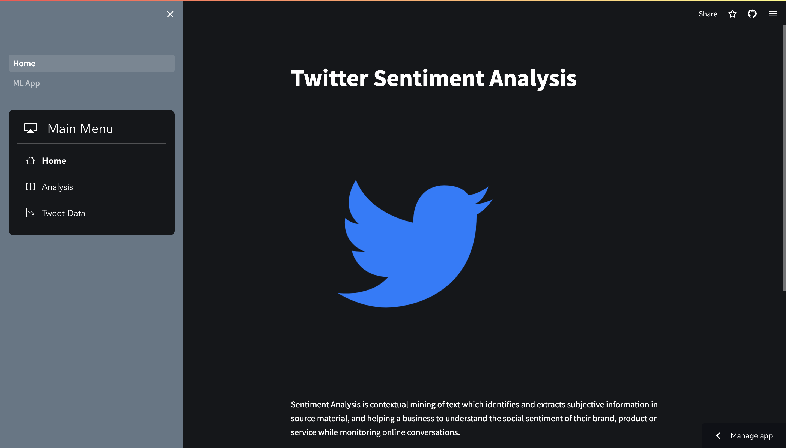
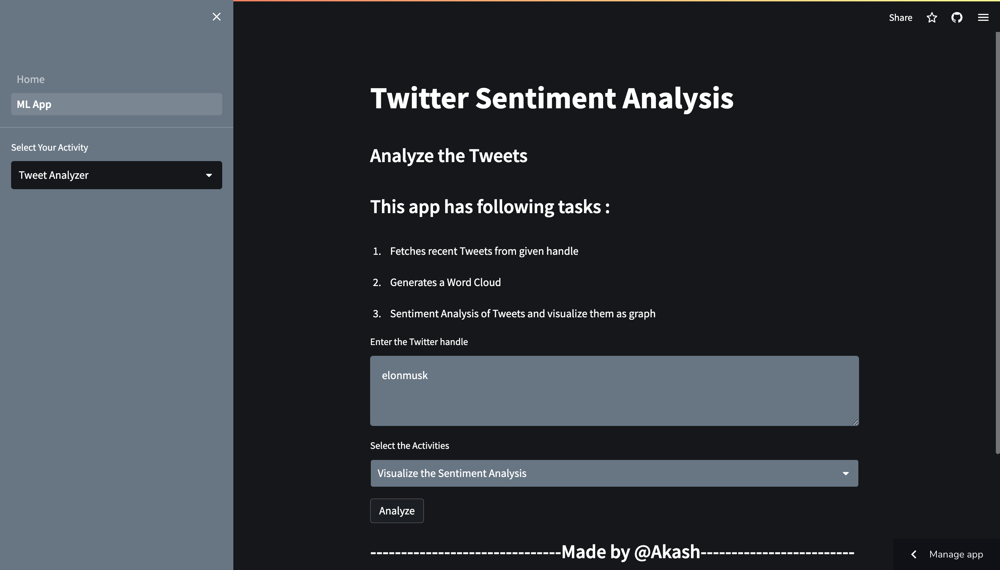
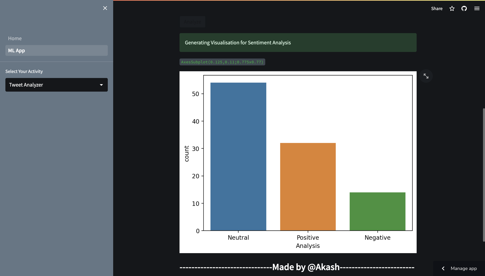

# Twitter_sentiment_Streamlit
The objective of Twitter sentiment analysis is to analyze the public opinion and emotional response towards a particular topic, brand, or event on Twitter. It involves extracting, processing, and categorizing tweets as positive, negative, or neutral, to understand the overall sentiment towards the subject of interest. The goal is to gain insights into how people feel about a topic, identify trends, and monitor changes in public opinion over time.

# Description
Twitter sentiment analysis is a powerful tool that can help businesses, organizations, and individuals to understand the perception of their brand, product, or service on Twitter. It involves collecting tweets related to the topic of interest, cleaning and preprocessing the data, and then applying machine learning algorithms to classify the tweets as positive, negative, or neutral.

The analysis can provide insights into various aspects such as the intensity of the sentiment, the volume of tweets, the geographical location of the users, and the demographics of the audience. This information can help organizations to measure their brand awareness, track customer satisfaction, monitor the competition, and identify potential crisis situations.

Twitter sentiment analysis can also be used for social listening, which involves monitoring conversations on Twitter to identify emerging trends, consumer needs, and preferences. By analyzing the sentiment of tweets, businesses can gain a deeper understanding of their target audience and adjust their marketing strategies accordingly.

Overall, Twitter sentiment analysis is a valuable tool for businesses, organizations, and individuals who want to monitor public opinion, gain insights into consumer behavior, and improve their social media presence.

# Web-App

# Machine Learning Model

# Visualizations

# How to Use
1. Select ML APP from side bar.  
   a) ML App
3. Enter a Twitter username without @
4. Select options from drop down menu 
   a) Show recent tweets.  
   b) Generate Wordcloud.  
   c) Visualize Sentiments. 
4. Click Anazyze

# Languages Used
Python. 
I develop this project using Python.

# Libraries Used
Tweepy: A Python library that provides easy access to the Twitter API. It allows you to collect tweets, analyze them, and extract relevant information such as user data, tweet text, and metadata.

NLTK: A Python library that provides a suite of natural language processing tools. It includes functions for text classification, tokenization, and sentiment analysis.

TextBlob: A Python library that provides a simple API for performing common natural language processing tasks, including sentiment analysis. It uses a pre-trained sentiment analyzer that can classify text as positive, negative, or neutral.

VaderSentiment: A Python library that is specifically designed for sentiment analysis on social media platforms like Twitter. It uses a lexicon-based approach to classify text as positive, negative, or neutral.

Scikit-learn: A Python library that provides machine learning tools for text classification and sentiment analysis. It includes algorithms such as Naive Bayes, Logistic Regression, and Support Vector Machines that can be used for sentiment analysis.

Gensim: A Python library that provides tools for topic modeling and natural language processing. It includes functions for analyzing text data, clustering, and sentiment analysis.

# Framework Used
Streamlit

